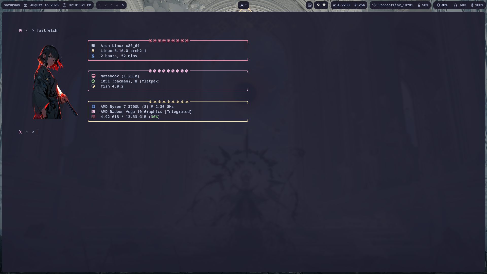
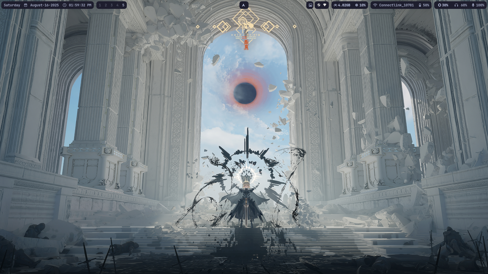
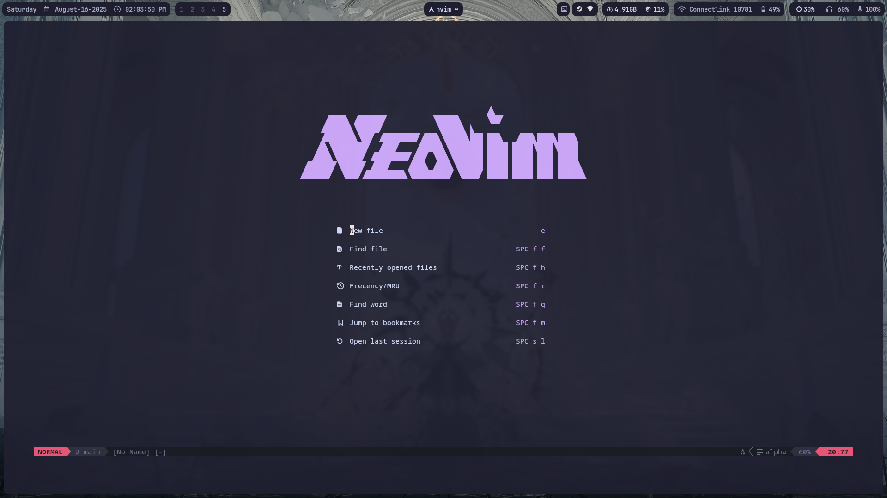
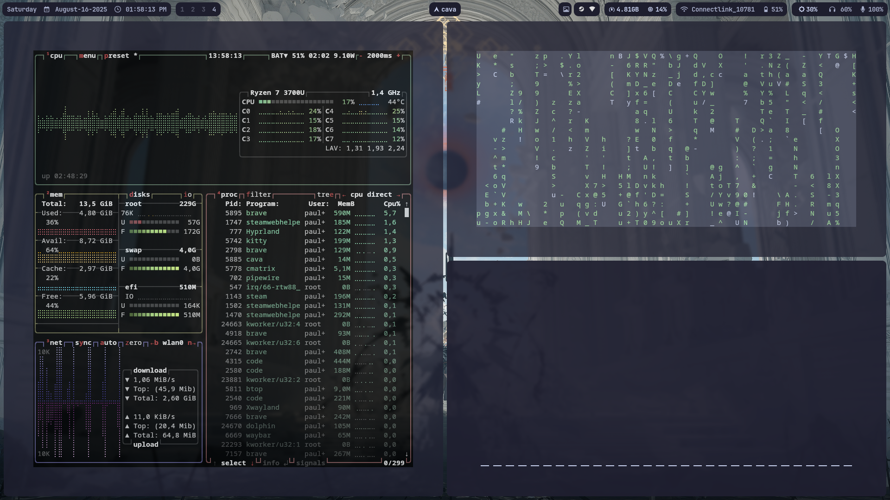

# paulinzz dotfiles
Principais Configurações pessoais para arch linux com Hyprland. 


## Terminal / Fastfetch

## Desktop

## Rofi

## Nvim

## Ferramentas

(btop, cmatrix, cava)

# 📦 Dependências

Antes de usar, instale os seguintes pacotes:

### 🖥️ Ambiente gráfico (Wayland)
- [Hyprland](https://github.com/hyprwm/Hyprland)
- [Waybar](https://github.com/Alexays/Waybar)
- `wl-clipboard` `waypaper` `grim` `slurp` `hyprpaper`


## Principais Componentes
- `kitty` (terminal)
- `fish` (shell)
- `neovim` (editor)
- `rofi` (menu de apps)
- `dunst` (notificações)
- `fastfetch` (splash info)
- `pavucontrol` (controle de mídia)
- `mpd` + `ncmpcpp` (player de música)
- `btop` ou `htop` (monitor do sistema)
- `grim` e `slurp` (print)
- `hyprpaper`,`swww` e `waypaper` (ferramenta para wallpaper)
- `hyprlock` (ferramenta para bloquear a tela)
- `hypridle` (ferramenta em conjunto com o hyprlock / ferramenta de monitoriamento de tela)

###  Aparência
- [JetBrains Mono Nerd Font](https://www.nerdfonts.com/font-downloads)
- `papirus-icon-theme`
- `qt5ct` `qt6ct` (opcional, para temas Qt)


## 🚀 Instalação

1. Clone os dotfiles:
   ```bash
   git clone https://github.com/Paulinzz/dotfiles.git
   ```

2. Crie links simbólicos (ou copie) para os diretórios de configuração:

   ```bash
   ln -s ~/.dotfiles/hypr ~/.config/hypr
   ln -s ~/.dotfiles/waybar ~/.config/waybar
   ln -s ~/.dotfiles/kitty ~/.config/kitty
   ln -s ~/.dotfiles/fish ~/.config/fish
   ln -s ~/.dotfiles/nvim ~/.config/nvim
   ln -s ~/.dotfiles/rofi ~/.config/rofi
   ln -s ~/.dotfiles/dunst ~/.config/dunst
   ```
3. Torne o Fish seu shell padrão (opcional):
   ```bash
   chsh -s /usr/bin/fish
   ```
   
---
## Modificador Principal
| Variável       | Tecla                        |
|----------------|-----------------------------|
| `$mainMod`     | SUPER (tecla Windows)        |

---

## Atalhos Gerais
| Atalho                       | Ação                                     |
|-------------------------------|-----------------------------------------|
| `$mainMod + T`               | Abrir terminal                          |
| `$mainMod + Q`               | Fechar janela ativa                      |
| `$mainMod + M`               | Sair do Hyprland                         |
| `$mainMod + E`               | Abrir gerenciador de arquivos           |
| `$mainMod + W`               | Alternar janela flutuante               |
| `$mainMod + R`                  | Abrir rofi                               |
| `$mainMod + J`               | Alternar modo split (dwindle)           |
| `$mainMod + C`               | Abrir VSCode                             |
| `$mainMod + B`               | Abrir navegador                          |
| `$mainMod + Shift + L`       | Bloquear tela (hyprlock)                |
| `$mainMod + F`               | Alternar fullscreen (janela ativa)      |
| `$mainMod + Shift + F`       | Alternar fullscreen (geral)             |

---

## Screenshots
| Atalho                       | Ação                                     |
|-------------------------------|-----------------------------------------|
| `$mainMod + P`               | Screenshot da janela ativa               |
| `$mainMod + Shift + P`       | Screenshot do monitor                    |
| `$shiftMod + P`              | Screenshot de região                     |

---

## Navegação entre janelas
| Atalho                       | Ação                                     |
|-------------------------------|-----------------------------------------|
| `$mainMod + Arrow`            | Mover foco para a direção correspondente|
| `$mainMod + Shift + Arrow`    | Mover janela ativa                        |

---

## Workspaces
| Atalho                       | Ação                                     |
|-------------------------------|-----------------------------------------|
| `$mainMod + [1-9,0]`         | Mudar para workspace 1–10                |
| `$mainMod + Shift + [1-9,0]` | Mover janela ativa para workspace 1–10   |
| `$mainMod + S`                | Alternar workspace especial `magic`      |
| `$mainMod + Shift + S`        | Mover janela ativa para workspace especial|

### Scroll Workspaces
| Atalho                       | Ação                                     |
|-------------------------------|-----------------------------------------|
| `$mainMod + mouse_down`       | Próximo workspace                        |
| `$mainMod + mouse_up`         | Workspace anterior                        |

---

## Movimentação e Redimensionamento
| Atalho                       | Ação                                     |
|-------------------------------|-----------------------------------------|
| `$mainMod + LMB`              | Mover janela                              |
| `$mainMod + RMB`              | Redimensionar janela                      |

---

## Waybar
| Atalho                       | Ação                                     |
|-------------------------------|-----------------------------------------|
| `$mainMod + Escape`           | Fechar ou abrir Waybar                    |

---

## Referências
- [Hyprland Wiki](https://wiki.hypr.land/)
- [GitHub Waybar](https://github.com/Alexays/Waybar)
- [Waybar references](https://gitlab.com/stephan-raabe/dotfiles)
- [fastfetch references](https://github.com/fastfetch-cli/fastfetch)
- [Unixporn](https://www.reddit.com/r/unixporn/)
- [Hyprland Config Keywords](https://wiki.hyprland.org/Configuring/Keywords/)
- [Hyprland Binds](https://wiki.hyprland.org/Configuring/Binds/)

